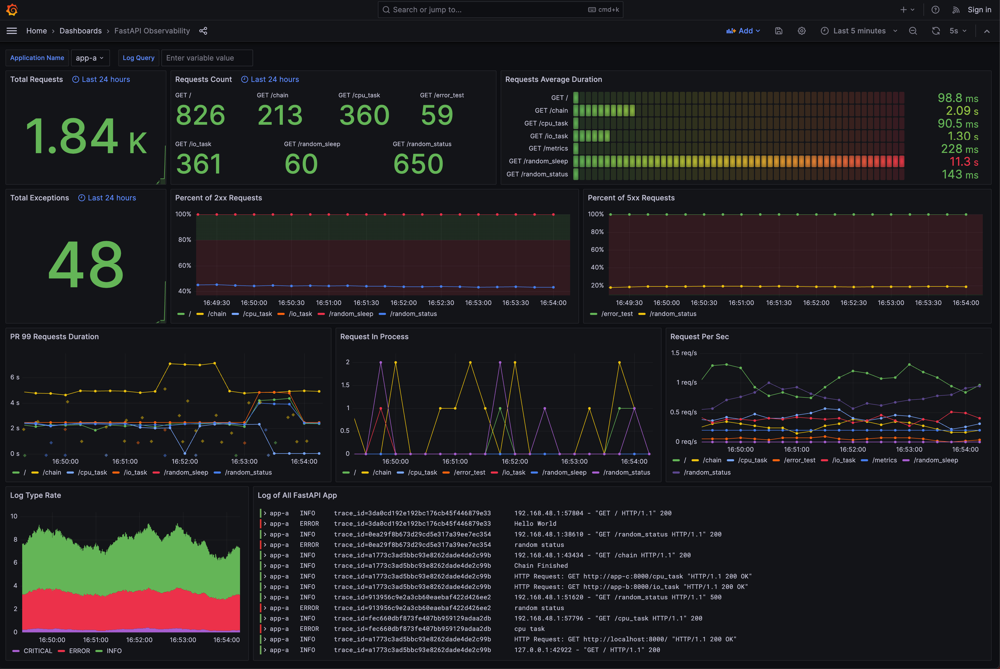
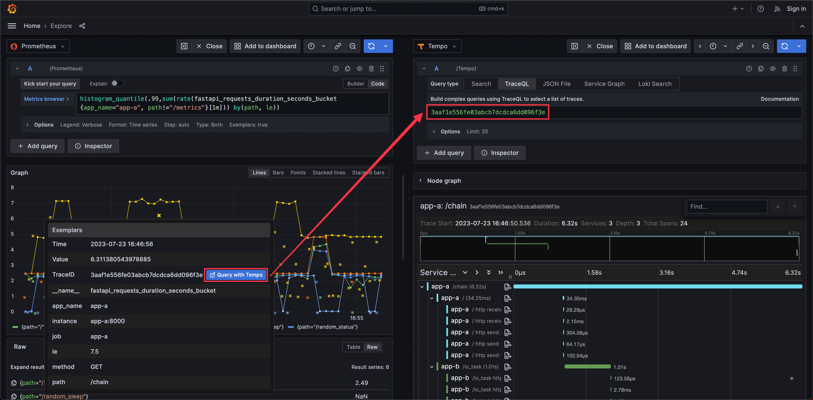
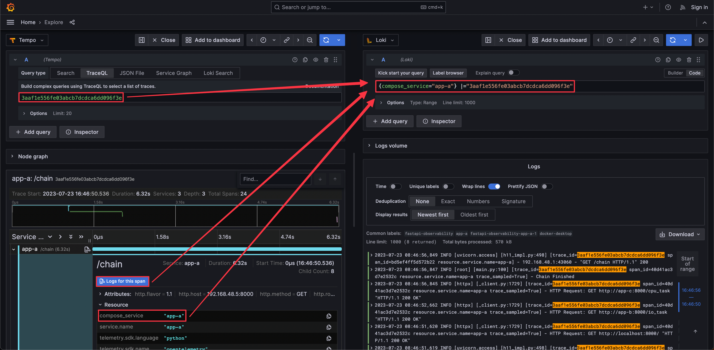
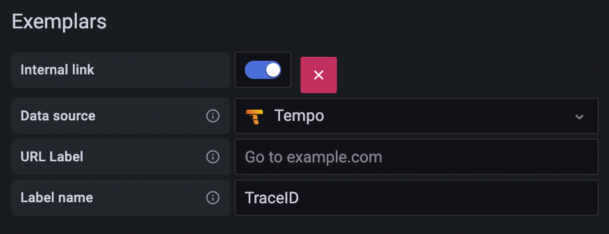

# FastAPI with Observability

Observe the FastAPI application with three pillars of observability on [Grafana](https://github.com/grafana/grafana):

1. Traces with [Tempo](https://github.com/grafana/tempo) and [OpenTelemetry Python SDK](https://github.com/open-telemetry/opentelemetry-python)
2. Metrics with [Prometheus](https://prometheus.io/) and [Prometheus Python Client](https://github.com/prometheus/client_python)
3. Logs with [Loki](https://github.com/grafana/loki)


## Table of contents
  - [Quick Start](#quick-start)
  - [Explore with Grafana](#explore-with-grafana)
    - [Metrics to Traces](#metrics-to-traces)
    - [Traces to Logs](#traces-to-logs)
    - [Logs to Traces](#logs-to-traces)
  - [Detail](#detail)
    - [FastAPI Application](#fastapi-application)
      - [Traces and Logs](#traces-and-logs)
      - [Span Inject](#span-inject)
      - [Metrics](#metrics)
    - [Prometheus - Metrics](#prometheus---metrics)
      - [Prometheus Config](#prometheus-config)
      - [Grafana Data Source](#grafana-data-source)
    - [Tempo - Traces](#tempo---traces)
      - [Grafana Data Source](#grafana-data-source-1)
    - [Loki - Logs](#loki---logs)
      - [Loki Docker Driver](#loki-docker-driver)
      - [Grafana Data Source](#grafana-data-source-2)
    - [Grafana](#grafana)
  - [Reference](#reference)

## Quick Start

1. Install [Loki Docker Driver](https://grafana.com/docs/loki/latest/clients/docker-driver/)

   ```bash
   docker plugin install grafana/loki-docker-driver:latest --alias loki --grant-all-permissions
   ```

2. Build application image and start all services with docker-compose

   ```bash
   docker-compose build
   docker-compose up -d
   ```

3. Send requests with [siege](https://linux.die.net/man/1/siege) to the FastAPI app

   ```bash
   bash request-script.sh
   bash trace.sh
   ```

4. Check predefined dashboard `FastAPI Observability` on Grafana [http://localhost:3000/](http://localhost:3000/)

   Dashboard screenshot:

   

   The dashboard is also available on [Grafana Dashboards](https://grafana.com/grafana/dashboards/16110).

## Explore with Grafana

Grafana provides a great solution, which could observe specific actions in service between traces, metrics, and logs through trace ID and exemplar.


Image Source: [Grafana](https://grafana.com/blog/2021/03/31/intro-to-exemplars-which-enable-grafana-tempos-distributed-tracing-at-massive-scale/)

### Metrics to Traces

Get Trace ID from an exemplar in metrics, then query in Tempo.

Query: `histogram_quantile(.99,sum(rate(fastapi_requests_duration_seconds_bucket{app_name="app-a", path!="/metrics"}[1m])) by(path, le))`



### Traces to Logs

Get Trace ID and tags (here is `compose.service`) defined in Tempo data source from span, then query with Loki.



### Logs to Traces

Get Trace ID pared from log (regex defined in Loki data source), then query in Tempo.


## Detail

### FastAPI Application

For a more complex scenario, we use three FastAPI applications with the same code in this demo. There is a cross-service action in `/chain` endpoint, which provides a good example of how to use OpenTelemetry SDK and how Grafana presents trace information.

#### Traces and Logs

We use [OpenTelemetry Python SDK](https://github.com/open-telemetry/opentelemetry-python) to send trace info with gRCP to Tempo. Each request span contains other child spans when using OpenTelemetry instrumentation. The reason is that instrumentation will catch each internal asgi interaction ([opentelemetry-python-contrib issue #831](https://github.com/open-telemetry/opentelemetry-python-contrib/issues/831#issuecomment-1005163018)). If you want to get rid of the internal spans, there is a [workaround](https://github.com/open-telemetry/opentelemetry-python-contrib/issues/831#issuecomment-1116225314) in the same issue #831 by using a new OpenTelemetry middleware with two overridden methods for span processing.

We use [OpenTelemetry Logging Instrumentation](https://opentelemetry-python-contrib.readthedocs.io/en/latest/instrumentation/logging/logging.html) to override the logger format with another format with trace id and span id.

```py
# fastapi_app/utils.py

def setting_otlp(app: ASGIApp, app_name: str, endpoint: str, log_correlation: bool = True) -> None:
    # Setting OpenTelemetry
    # set the service name to show in traces
    resource = Resource.create(attributes={
        "service.name": app_name, # for Tempo to distinguish source
        "compose_service": app_name # as a query criteria for Trace to logs
    })

    # set the tracer provider
    tracer = TracerProvider(resource=resource)
    trace.set_tracer_provider(tracer)

    tracer.add_span_processor(BatchSpanProcessor(
        OTLPSpanExporter(endpoint=endpoint)))

    if log_correlation:
        LoggingInstrumentor().instrument(set_logging_format=True)

    FastAPIInstrumentor.instrument_app(app, tracer_provider=tracer)
```

The following image shows the span info sent to Tempo and queried on Grafana. Trace span info provided by `FastAPIInstrumentor` with trace ID (17785b4c3d530b832fb28ede767c672c), span id(d410eb45cc61f442), service name(app-a), custom attributes(service.name=app-a, compose_service=app-a) and so on.


Log format with trace id and span id, which override by `LoggingInstrumentor`

```txt
%(asctime)s %(levelname)s [%(name)s] [%(filename)s:%(lineno)d] [trace_id=%(otelTraceID)s span_id=%(otelSpanID)s resource.service.name=%(otelServiceName)s] - %(message)s
```

The following image is what the logs look like.


#### Span Inject

If you want other services to use the same Trace ID, you have to use `inject` function to add current span information to the header. Because OpenTelemetry FastAPI instrumentation only takes care of the asgi app's request and response, it does not affect any other modules or actions like sending HTTP requests to other servers or function calls.

```py
# fastapi_app/main.py

from opentelemetry.propagate import inject

@app.get("/chain")
async def chain(response: Response):

    headers = {}
    inject(headers)  # inject trace info to header

    async with httpx.AsyncClient() as client:
        await client.get(f"http://localhost:8000/", headers=headers,)
    async with httpx.AsyncClient() as client:
        await client.get(f"http://{TARGET_ONE_HOST}:8000/io_task", headers=headers,)
    async with httpx.AsyncClient() as client:
        await client.get(f"http://{TARGET_TWO_HOST}:8000/cpu_task", headers=headers,)

    return {"path": "/chain"}
```

#### Metrics

Use [Prometheus Python Client](https://github.com/prometheus/client_python) to generate OpenTelemetry format metric with [exemplars](https://github.com/prometheus/client_python#exemplars) and expose on `/metrics` for Prometheus.

In order to add an exemplar to metrics, we retrieve the trace id from the current span for the exemplar and add the trace id dict to the Histogram or Counter metrics.

```py
# fastapi_app/utils.py

from opentelemetry import trace
from prometheus_client import Histogram

REQUESTS_PROCESSING_TIME = Histogram(
    "fastapi_requests_duration_seconds",
    "Histogram of requests processing time by path (in seconds)",
    ["method", "path", "app_name"],
)

# retrieve trace id for exemplar
span = trace.get_current_span()
trace_id = trace.format_trace_id(
      span.get_span_context().trace_id)

REQUESTS_PROCESSING_TIME.labels(method=method, path=path, app_name=self.app_name).observe(
      after_time - before_time, exemplar={'TraceID': trace_id}
)
```

Because exemplars is a new datatype proposed in [OpenMetrics](https://github.com/OpenObservability/OpenMetrics/blob/main/specification/OpenMetrics.md#exemplars), `/metrics` have to use `CONTENT_TYPE_LATEST` and `generate_latest` from `prometheus_client.openmetrics.exposition` module instead of `prometheus_client` module. Otherwise using the wrong generate_latest the exemplars dict behind Counter and Histogram will never show up, and using the wrong CONTENT_TYPE_LATEST will cause Prometheus scraping to fail.

```py
# fastapi_app/utils.py

from prometheus_client import REGISTRY
from prometheus_client.openmetrics.exposition import CONTENT_TYPE_LATEST, generate_latest

def metrics(request: Request) -> Response:
    return Response(generate_latest(REGISTRY), headers={"Content-Type": CONTENT_TYPE_LATEST})
```

Metrics with exemplars


### Prometheus - Metrics

Collects metrics from applications.

#### Prometheus Config

Define all FastAPI applications metrics scrape jobs in `etc/prometheus/prometheus.yml`.

```yaml
...
scrape_configs:
  - job_name: 'app-a'
    scrape_interval: 5s
    static_configs:
      - targets: ['app-a:8000']
  - job_name: 'app-b'
    scrape_interval: 5s
    static_configs:
      - targets: ['app-b:8000']
  - job_name: 'app-c'
    scrape_interval: 5s
    static_configs:
      - targets: ['app-c:8000']
```

#### Grafana Data Source

Add an Exemplars which uses the value of `TraceID` label to create a Tempo link.

Grafana data source setting example:



Grafana data sources config example:

```yaml
name: Prometheus
type: prometheus
typeName: Prometheus
access: proxy
url: http://prometheus:9090
password: ''
user: ''
database: ''
basicAuth: false
isDefault: true
jsonData:
exemplarTraceIdDestinations:
   - datasourceUid: tempo
      name: TraceID
httpMethod: POST
readOnly: false
editable: true
```

### Tempo - Traces

Receives spans from applications.

#### Grafana Data Source

[Trace to logs](https://grafana.com/docs/grafana/latest/datasources/tempo/#trace-to-logs) setting:

1. Data source: target log source
2. Tags: key of tags or process level attributes from the trace, which will be log query criteria if the key exists in the trace
3. Map tag names: Convert existing key of tags or process level attributes from trace to another key, then used as log query criteria. Use this feature when the values of the trace tag and log label are identical but the keys are different.

Grafana data source setting example:


Grafana data sources config example:

```yaml
name: Tempo
type: tempo
typeName: Tempo
access: proxy
url: http://tempo
password: ''
user: ''
database: ''
basicAuth: false
isDefault: false
jsonData:
nodeGraph:
   enabled: true
tracesToLogs:
   datasourceUid: loki
   filterBySpanID: false
   filterByTraceID: true
   mapTagNamesEnabled: false
   tags:
      - compose_service
readOnly: false
editable: true
```

### Loki - Logs

Collects logs with Loki Docker Driver from all services.

#### Loki Docker Driver

1. Use [YAML anchor and alias](https://support.atlassian.com/bitbucket-cloud/docs/yaml-anchors/) feature to set logging options for each service.
2. Set [Loki Docker Driver options](https://grafana.com/docs/loki/latest/clients/docker-driver/configuration/)
   1. loki-url: loki service endpoint
   2. loki-pipeline-stages: processes multiline log from FastAPI application with multiline and regex stages ([reference](https://grafana.com/docs/loki/latest/clients/promtail/stages/multiline/))

```yaml
x-logging: &default-logging # anchor(&): 'default-logging' for defines a chunk of configuration
  driver: loki
  options:
    loki-url: 'http://localhost:3100/api/prom/push'
    loki-pipeline-stages: |
      - multiline:
          firstline: '^\d{4}-\d{2}-\d{2} \d{1,2}:\d{2}:\d{2}'
          max_wait_time: 3s
      - regex:
          expression: '^(?P<time>\d{4}-\d{2}-\d{2} \d{1,2}:\d{2}:\d{2},d{3}) (?P<message>(?s:.*))$$'
# Use $$ (double-dollar sign) when your configuration needs a literal dollar sign.

version: "3.4"

services:
   foo:
      image: foo
      logging: *default-logging # alias(*): refer to 'default-logging' chunk 
```

#### Grafana Data Source

Add a TraceID derived field to extract the trace id and create a Tempo link from the trace id.

Grafana data source setting example:


Grafana data source config example:

```yaml
name: Loki
type: loki
typeName: Loki
access: proxy
url: http://loki:3100
password: ''
user: ''
database: ''
basicAuth: false
isDefault: false
jsonData:
derivedFields:
   - datasourceUid: tempo
      matcherRegex: (?:trace_id)=(\w+)
      name: TraceID
      url: $${__value.raw}
      # Use $$ (double-dollar sign) when your configuration needs a literal dollar sign.
readOnly: false
editable: true
```

### Grafana

1. Add Prometheus, Tempo, and Loki to the data source with config file `etc/grafana/datasource.yml`.
2. Load predefined dashboard with `etc/dashboards.yaml` and `etc/dashboards/fastapi-observability.json`.

```yaml
# grafana in docker-compose.yaml
grafana:
   image: grafana/grafana:8.4.3
   volumes:
      - ./etc/grafana/:/etc/grafana/provisioning/datasources # data sources
      - ./etc/dashboards.yaml:/etc/grafana/provisioning/dashboards/dashboards.yaml # dashboard setting
      - ./etc/dashboards:/etc/grafana/dashboards # dashboard json files directory
```

## Reference

1. [FastAPI Traces Demo](https://github.com/softwarebloat/python-tracing-demo)
2. [Waber - A Uber-like (Car-Hailing APP) cloud-native application with OpenTelemetry](https://github.com/Johnny850807/Waber)
3. [Intro to exemplars, which enable Grafana Tempo’s distributed tracing at massive scale](https://grafana.com/blog/2021/03/31/intro-to-exemplars-which-enable-grafana-tempos-distributed-tracing-at-massive-scale/)
4. [Trace discovery in Grafana Tempo using Prometheus exemplars, Loki 2.0 queries, and more](https://grafana.com/blog/2020/11/09/trace-discovery-in-grafana-tempo-using-prometheus-exemplars-loki-2.0-queries-and-more/)
5. [The New Stack (TNS) observability app](https://github.com/grafana/tns)
6. [Don’t Repeat Yourself with Anchors, Aliases and Extensions in Docker Compose Files](https://medium.com/@kinghuang/docker-compose-anchors-aliases-extensions-a1e4105d70bd)
7. [How can I escape a $ dollar sign in a docker compose file?](https://stackoverflow.com/a/40621373)
8. [Tempo Trace to logs tags discussion](https://community.grafana.com/t/need-to-customize-tempo-option-for-trace-logs-with-loki/59612)
9. [Starlette Prometheus](https://github.com/perdy/starlette-prometheus)
